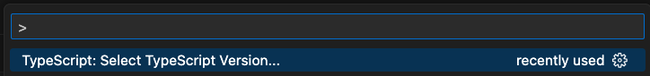
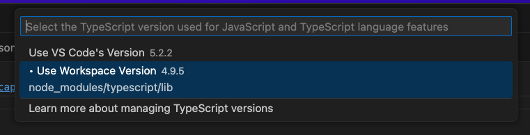
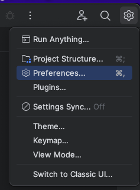
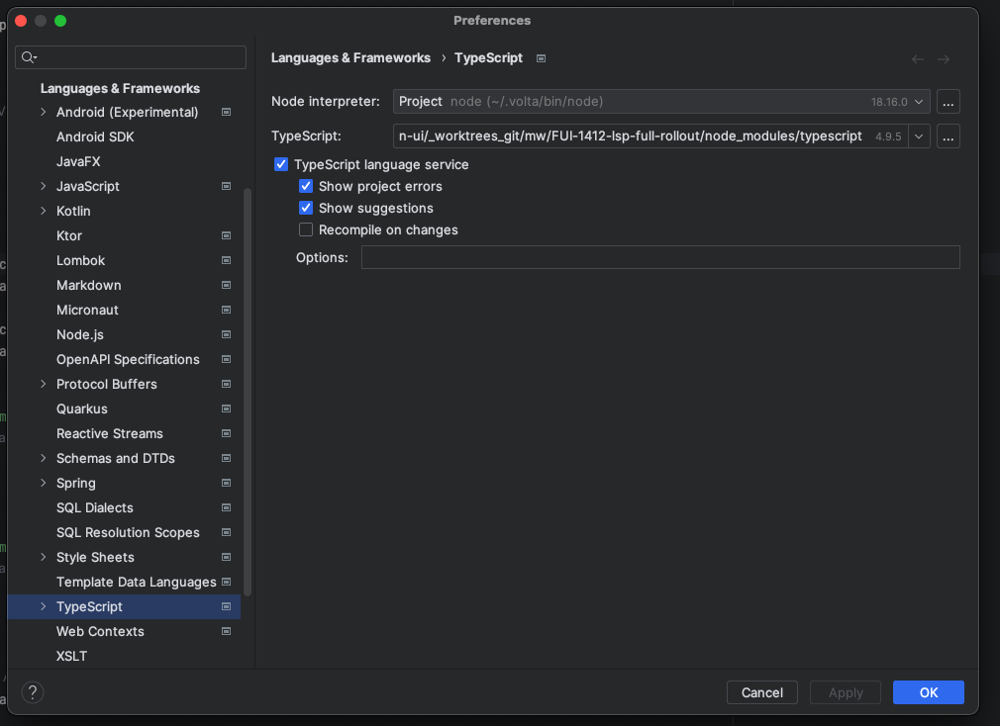

# Web Client

## Frontend stack

Genesis components are standards-based Web Components, making them compatible with almost any modern web framework.
Our state-of-the-art design system and component set is built on top of
[Microsoft FAST](https://www.fast.design/docs/introduction/).

# Development

1. Install dependencies:

```shell
npm run bootstrap
```

2. Start Web development server in watch mode:

```shell
npm run dev
```

3. Build for production:

```shell
npm run build
```

Preview production build:

```shell
npm run serve
```

## Clean

Remove distribution and node_modules directories:

```shell
npm run clean
```

Baseline task combines `clean` and `bootstrap` tasks into a single command:

```shell
npm run baseline
```

## Custom Elements IntelliSense

Using any modern editor, you'll receive IntelliSense help while writing TypeScript code while working in the repo. However, you'll also likely be writing a lot of html markup inside of "html\`\`" blocks.
By default you'll not get any IntelliSense provided in that scenario, but you can enable this while working in the monorepo by leveraging the open source [custom elements lsp](https://www.npmjs.com/package/@genesiscommunitysuccess/custom-elements-lsp) that Genesis provides. This comes pre-configured when you create a seed with `genx`.

### VSCode

VSCode has full support for the plugin, and is the recommended IDE to use if you're new working with the web code. To enable the LSP you'll need to follow the following steps.

1. You need a `.vscode/settings.json` file from the place that you launch your IDE. This has been added to the root of your project automatically, but you'll need to create it in a different place if you want to launch your editor from a different directory. The contents should contain a `typescript.tsdk` key which points to your local typescript install.
> This is the same file you'll edit if you want to set a specific workspace config. In that case you can have the `typescript.tsdk` key defined, as well as any other config you would like.

2. Launch VSCode on the root directory of the project (so in the folder structure you'll have `.vscode` directory from step 1 at the root). You can do this via the GUI or if you've installed VSCode on your path you can navigate to the root and run `code .`.

3. Ensuring you have a typescript file open, open the command palette (Ctrl/Cmd + Shift + P) and search for `TypeScript: Select Typescript Version...`

> If you don't see this option then ensure you have a `.ts` file open.
> If you don't see this option, it may be because you need to set VSCode to trust the workspace (so it picks up the config from step 1) when asked.

4. Select the workspace version, which should have the path matching the path set in the value of step 1.

> If you don't see this option then ensure that you've opened the project in VSCode that has the `.vscode` directory from step 1 at the root.

5. That should be it! Please note that you'll not see any diagnostics information after the LSP had loaded until you interact and change the file.

### JetBrains

This section applies to JetBrains IDEs such as IntelliJ and Webstorm, though the location of the settings menus might slightly differ between versions.

**IMPORTANT**: Currently JetBrains does not leverage the TypeScript server for full IntelliSense in their IDEs so our plugin can only offer limited functionality. You should receive full diagnostics support from the plugin, but only limited definition coverage, and no help with autocompletion. Currently we are in discussion with JetBrains to come to a solution about this.

1. Launch the IDE.

2. Open the preferences menu option from the settings.


3. Navigate to the `Typescript` settings in the `Languages & Frameworks` settings, and ensure that the typescript option is set to the `node_modules/typescript` of your _local_ project, as shown in the image. This may be the default already, in which case you don't need to do anything. You'll also want to enable at least the three options which are enabled in the image below.


4. That should be it! Please note that you'll not see any diagnostics information after the LSP had loaded until you interact and change the file.
